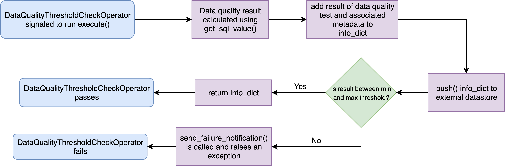
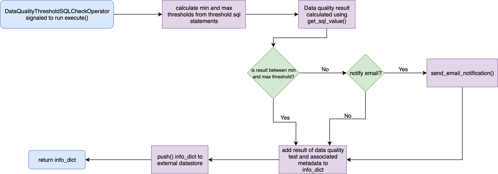

# airflow-dq

## Introduction
An Airflow module that includes operators to perform data quality checks. This module includes an Airflow operator that periodically check the results of a query and validates it against a specified threshold.  

Optionally: 

 - If it exceeds the specified threshold level and an Airflow operator that sends an alert through email about given threshold breach
 - Results can be pushed to an external database to store the execution results history

## Features
This Airflow module contains the following operators:
- `BaseDataQualityOperator`
- `DataQualityThresholdCheckOperator`
- `DataQualityThresholdCheckSQLOperator`

### `BaseDataQualityOperator`
`BaseDataQualityOperator` found in [`base_data_quality_operator.py`](plugins/base_data_quality_operator.py) is derived from `BaseOperator` and is used as an inherited class in the other operators. This operator shares common attributes with the operators. These functions include:
- `get_sql_value()` - given database connection requirements, method will evaluate a result of a sql query and return if and only if is a single column, single row result
- `push()` - a user defined method that allows ability to export metadata from a data quality check to an external database for logging
- `send_email_notification()` - will send an email with specifications of the data quality test run. (Note: will only be run if a test fails)

### `DataQualityThresholdCheckOperator`
`DataQualityThresholdCheckOperator` found in [`data_quality_threshold_check_operator.py`](plugins/data_quality_threshold_check_operator.py) inherits from `BaseDataQualityOperator`. It is used to perform the data quality check against a threshold range. 

In this operator, the data quality check is executed using `get_sql_value()`. Thresholds are given as numeric values and the test will determine if the data quality result is within that range. If it is within the correct range, the `push()` method is called and the result and metadata is returned. Otherwise if the test fails, the `push()` is still called, but an email notification will be sent (if user passes a list of emails to be notified) using `send_email_notification()`.

### `DataQualityThresholdCheckSQLOperator`
`DataQualityThresholdCheckSQLOperator` found in [`data_quality_threshold_sql_check_operator.py`](plugins/data_quality_threshold_sql_check_operator.py) inherits from `BaseDataQualityOperator`. It is almost identical to `DataQualityThresholdCheckOperator`, however the only difference is that instead of passing threshold values into the operator, the operator will take in sql statements for the threshold.

The operator will collect the sql statement for the min and max threshold and before performing the data quality check, it will evelaute these sql statements using `get_sql_value()`. After collecting these threshold values, the operator will evaluate the data quality test and check against the thresholds and determine if the test fails or not. If it is within the correct range, the `push()` method is called and the result and metadata is returned. Otherwise if the test fails, the `push()` is still called, but an email notification will be sent (if user passes a list of emails to be notified) using `send_email_notification()`.

### YAML Usage [NOTE: Work in Progress]
YAML files can be used as configurations for each operator. A DAG-level implementation of how YAML files could be used is included [here](example_dag/example_data_quality_check_dag.py).

## Tests
Tests can be found [here](tests). Test directory gives an outline of each test file and the purpose of each. Additionally, it contains test configurations such as a sql script that creates test tables and configuration YAML files.

## Flowchart Diagrams
Diagrams below visualize flow of execution when `DataQualityThresholdCheckOperator` and `DataQualityThresholdSQLCheckOperator` are signaled to execute.

### DataQualityThresholdCheckOperator Flowchart

### DataQualityThresholdSQLCheckOperator Flowchart
